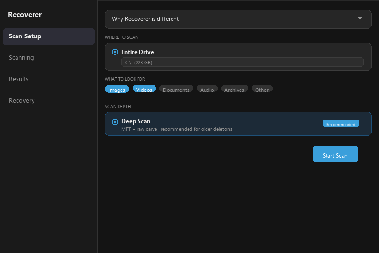

# Recoverer

A file recovery tool for Windows that does the work other tools skip.



## What makes it different

**Fragment chains.** A 4GB video split across a thousand sectors shows up as one entry. Recoverer groups consecutive same-type clusters, collapses them into a single file, and reads the full contiguous span during recovery - one pass instead of thousands of fragmented reads.

**Cross-session memory.** Surface scan one day, deeper carve a week later. Files you already recovered get pre-marked automatically. Cluster tracking persists across sessions so "hide recovered" actually works.

**Honest confidence scoring.** Header-only finds score 45%. Footer-confirmed: 65%. MFT-backed: 75%. You see exactly how solid each result is, not a fake uniform score.

**Span-based recovery.** For fragment chains, Recoverer computes the full sector span and reads it in 32 MB chunks. Prevents the disk-thrash that would make recovering a single fragmented video take hours.

**Rust engine.** Single binary, no runtime dependencies. Legacy C/C++ recovery tools silently corrupt results on edge-case sectors - a class of bug the Rust type system rules out.

## Stack

- **Engine**: Rust (NTFS parsing, raw sector carving, VSS, SQLite sessions)
- **UI**: C# + WinUI 3 / Windows App SDK, MVVM with CommunityToolkit

## Scan modes

| Mode | What it does | Time |
|------|-------------|------|
| Quick | MFT only - recently deleted files | 2-5 min |
| Deep | MFT + raw sector carve | Hours |
| Raw carve | Every sector - use if MFT is gone or drive was formatted | Hours |

## Building

**Prerequisites**: Rust toolchain, .NET 8 SDK, Windows App SDK 1.7

```
# Engine
cargo build --release --target x86_64-pc-windows-msvc

# Copy engine binary
copy target\x86_64-pc-windows-msvc\release\recoverer-engine.exe ui\Recoverer\

# UI (run from ui\Recoverer\)
dotnet build -c Release
```

The app requires elevation (administrator) to read raw disk sectors.

## License

MIT
